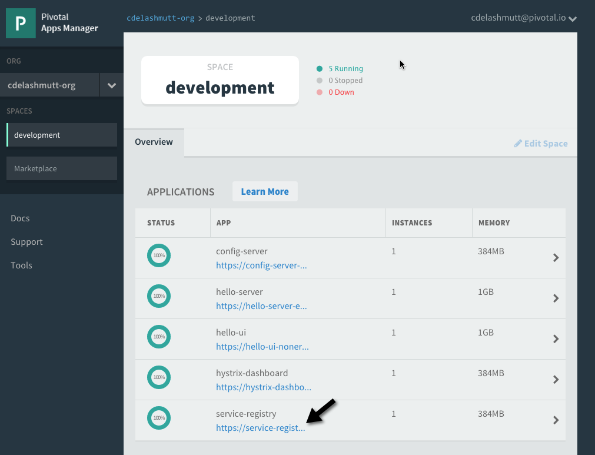
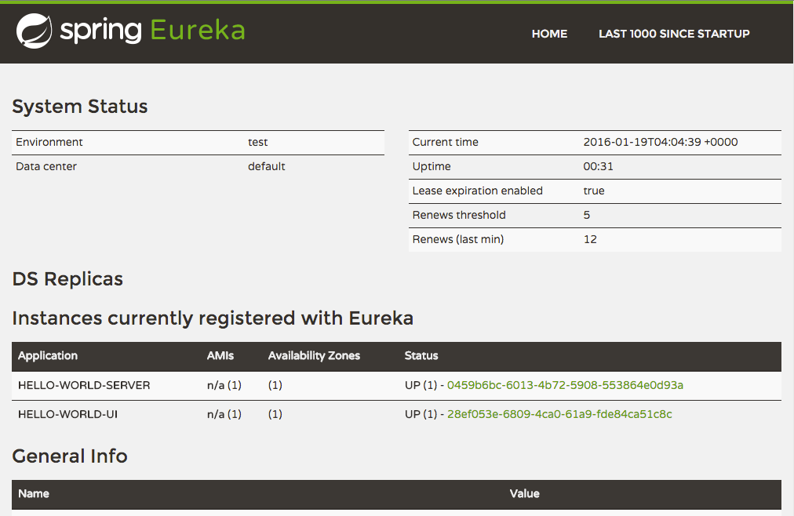

:compat-mode:
= Lab 9 - Exploring the Service Registry

. Open the Application Manager console in your browser.  Go to the org and space where you created the service instances and scroll down until you see application called "service-registry"
+

. Click the url link under the "service-registry" app name in the list to navigate to the UI for the service registry. Notice that both the server and UI apps have registered themselves. Explore the dashboard.
+

