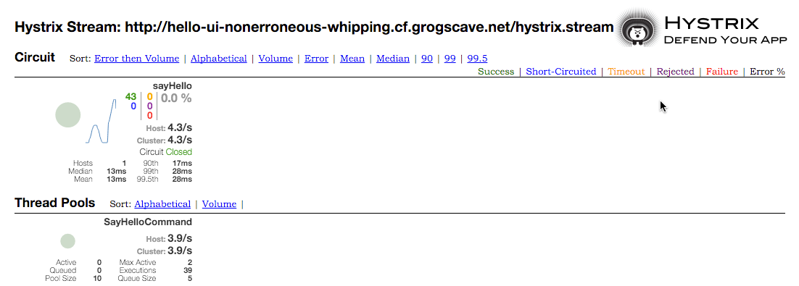

:compat-mode:
= Lab 11 - The Circuit Breaker Dashboard

== Use the Circuit Breaker Dashboard

. Open the Application Manager console in your browser.  Go to the org and space where you created the service instances and scroll down until you see the entry for the hystrix-dashboard app.
+
image::../../Common/images/lab11_no_scs_screenshot1.png[]
+
. Click the url link under the hystrix-dashboard app. 

. In the starting page, enter the url for your hello-ui application, using the http scheme, and the hystrix.stream resource like the example below:
+

. In another browser tab or window, open the Hello-UI app and add some text in the textbox.  You should see the execution counts change in the hystrix-dashboard app.
+

== Bonus
. Go to the Application Manager console and stop the Hello Server.

. Go to the Hello UI and enter some text for the Hello World Service.

. The Circuit Breaker Dashboard should show the Circuit Breaker has changed to "Open" and the error count is increasing.

. Start the Hello Server back up again.

. Go back to the Hello UI and see the service eventually comes back up again.
